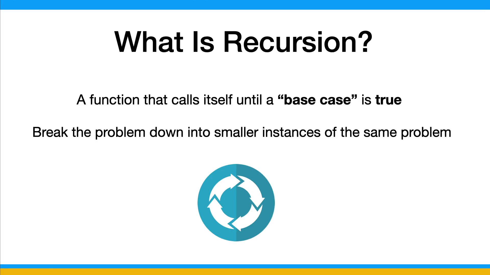
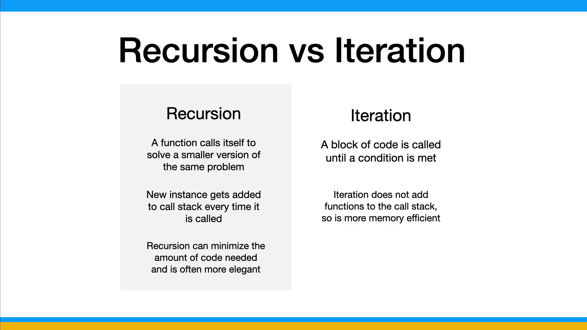
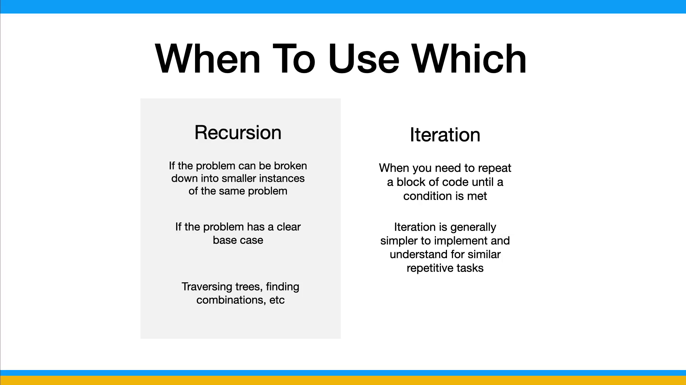
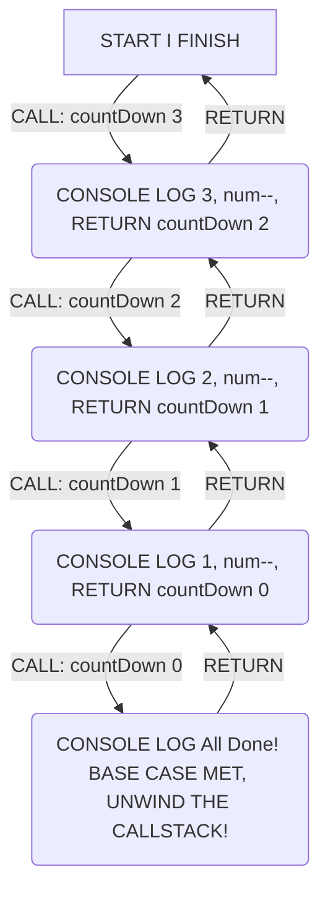

# Recursion Intro (countDown)

For the next few challenges, we're going to be looking at and using `recursion`, which is a popular topic in computer science. I know a lot of people struggle with recursion, so I'm going to try and explain it in really simple terms and we'll start off with some really simple examples and break them down. Understanding at least the basic concept of recursion is important and it's something that is often asked about in job interviews.

In programming terms, `recursion` is a function that calls itself until a "base case" or a "base condition" is true. In most recursive functions, we break the problem down into smaller instances and then use that solution to solve the original problem. Ill show you what I mean with an example in a few minutes.

When we call a function it gets added to what we call the call stack and when it comes to returning values, there's a concept called `unwinding`. I'm going to go over those in the next lesson. i don't want to throw too much at you at once.



One example that I like is the analogy of a Russian doll. A Russian doll is a set of wooden dolls of decreasing size placed one inside another. To get to the smallest doll, you have to open each doll one by one until you get to the prize or whatever is in the smallest doll or the smallest box. This is a recursive process.

With the Russian doll example, you could use a for loop if you knew how many dolls there were, but if you don't know the exact amount of iterations, as you often don't in programming, recursion can be a better option.


## Recursion vs iteration

At first glance, recursion and iteration (loops) seem to be very similar. They both can be used to solve the same problems, but there are some differences between them. There are also pros and cons to both.

As we've established, recursion is a function that calls itself until a base case is met and solves a smaller version of the same problem, while iteration is just a block of code that is executed a specific number of times.

When using recursion, you're adding function calls to the call stack and that takes up memory and can affect performance. Iteration doesn't because you aren't adding function instances. So that's one pro for iteration over recursion.

However, recursion can really minimize the amount of code needed and can be a very elegant solution and minimize complex problems.

Both recursion and iteration have their strengths and weaknesses, and the choice between them depends on the problem you're trying to solve and the code readability and efficiency you're aiming for.



#### When to use which

This really depends on the problem, the developer and many other factors, but in general:

- Use recursion when the problem can be broken down into smaller instances of the same problem and you have a clear base case. Recursion is often used for problems that have a natural recursive structure, like traversing trees or finding combinations.

- Use iteration when you need to repeat a block of code a specific number of times or until a condition is met. Iteration is generally simpler to implement and understand for simpler repetitive tasks.



## Code example

Let's look at a really simple example of recursion:

```js
function countDown(num) {
  // Base case
  if (num <= 0) {
    console.log("All done!");
    return;
  }

  // Recursive case
  console.log(num);
  num--;
  countDown(num);
}

countDown(3);
```

In this example, we have a function called `countDown` that takes in a number. We have what we call the `base case`, which is when the number is less than or equal to 0. If this is true, we log "All done!" and return. If it is not true, we run the `recursive case`, which will log the number, subtract 1 from it, and then call the function again with the new number. This will continue until the number is less than or equal to 0.

We are calling the same function with a smaller number each time. This is recursion.

### Diagram



### Test Cases

```js
describe("countDown", () => {
  const consoleLogSpy = jest.spyOn(console, "log").mockImplementation(() => {});

  afterAll(() => {
    consoleLogSpy.mockRestore();
  });

  it('should log numbers in reverse order and print "All done!"', () => {
    countDown(3);
    expect(consoleLogSpy).toHaveBeenNthCalledWith(1, 3); // 3 is logged first
    expect(consoleLogSpy).toHaveBeenNthCalledWith(2, 2); // 2 is logged next
    expect(consoleLogSpy).toHaveBeenNthCalledWith(3, 1); // 1 is logged last
    expect(consoleLogSpy).toHaveBeenNthCalledWith(4, "All done!"); // 'All done!' is logged after counting down
  });

  it("should handle num <= 0", () => {
    countDown(0);
    expect(consoleLogSpy).toHaveBeenCalledWith("All done!"); // 'All done!' is logged when num is 0
    countDown(-1);
    expect(consoleLogSpy).toHaveBeenCalledWith("All done!"); // 'All done!' is logged when num is negative
  });
});
```

In the next batch of challenges, we will be using recursion to solve some problems.
