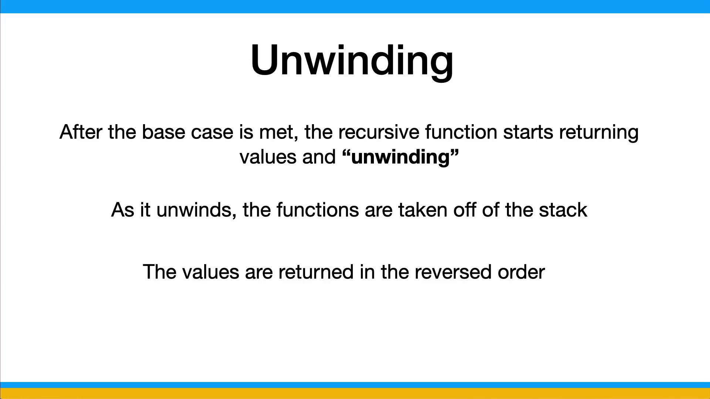
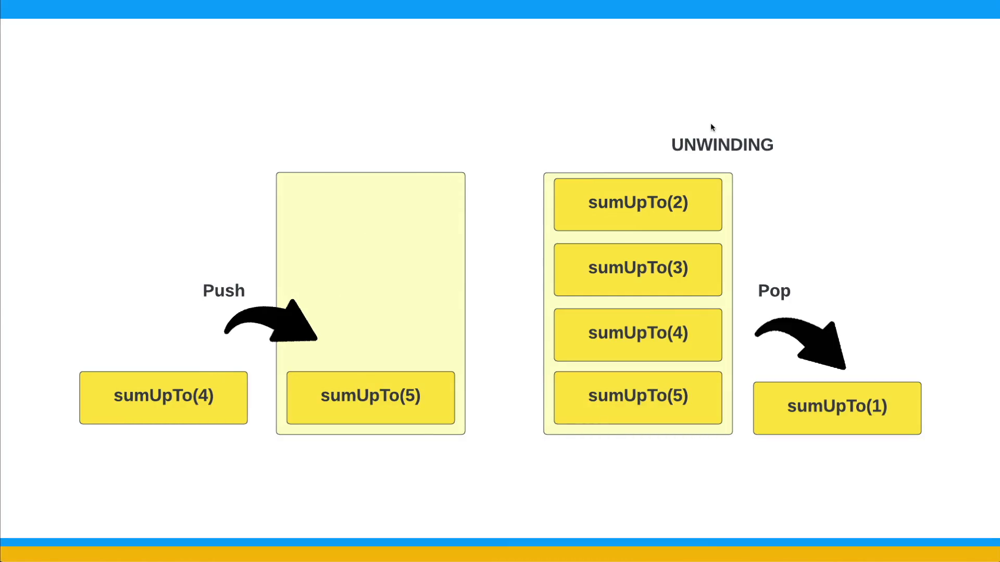
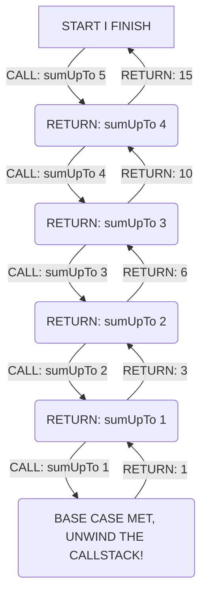

# Unwinding

We talked about the basics of recursion and looked at a simple example in the last lesson. In this lesson, I want to look at a key concept in recursion called "unwinding".

We know that when we run a function recursively, it calls itself until it reaches a base case. After it reaches that base is when it starts returning values as it "unwinds" the recursion. The order in which the function calls are returned is the reverse order of the function calls. This is because the function calls are added to the call stack, which is a LIFO (last in, first out) data structure.

We're actually going to look at stacks and other data structures later. In fact we will create our own implementation of a stack. I do want to explain the basics now though so that you can understand how recursion and unwinding work.



Let's look at an example of this. Consider the following function:

```js
function sumUpTo(n) {
  if (n === 1) {
    return 1;
  }

  return n + sumUpTo(n - 1);
}
```

This function uses recursion to calculate the sum of positive integers up to `n`. For example, if the input is 5, the function should return 15 (1 + 2 + 3 + 4 + 5).

Let's see how this function works. When we call `sumUpTo(5)`, it executes `sumUpTo(4) + 5`. Now, `sumUpTo(4)` calls `sumUpTo(3) + 4`. Continuing, `sumUpTo(3)` calls `sumUpTo(2) + 3`. In the next call, `sumUpTo(2)` calls `sumUpTo(1) + 2`. Finally, `sumUpTo(1)` returns 1.

Now, we can start "unwinding" the recursion and adding the numbers to form the sum:

```js
sumUpTo(1) returns 1
sumUpTo(2) returns 1 + 2 = 3
sumUpTo(3) returns 1 + 2 + 3 = 6
sumUpTo(4) returns 1 + 2 + 3 + 4 = 10
sumUpTo(5) returns 1 + 2 + 3 + 4 + 5 = 15
```

As you can see, the function starts returning values as it "unwinds" the recursion. It returns in the reverse order of the function calls, which is why it's called "unwinding".

## A Look At The Call Stack



As I said above, the call stack is a LIFO (last in, first out) data structure, which means that the last function that was added to the call stack is the first one to be removed. This is why the function calls are returned in the reverse order of the function calls.

When we first call `sumUpTo(5)`, it is added to the call stack. Then, `sumUpTo(4)` is added to the call stack and so on...


Once `sumUpTo(1)` is called, it returns 1 and is removed from the call stack. Then, `sumUpTo(2)` returns 3 and is removed from the call stack. This continues until `sumUpTo(5)` returns 15 and is removed from the call stack.


We can see this by logging the function calls and the return values:

```js
function sumUpTo(n) {
  if (n === 1) {
    console.log(`sumUpTo(${n}) returns 1`);
    return 1;
  }

  console.log(`sumUpTo(${n}) calls sumUpTo(${n - 1}) + ${n}`);
  const result = n + sumUpTo(n - 1);
  console.log(`sumUpTo(${n}) returns ${result}`);
  return result;
}
```

```js
sumUpTo(5) calls sumUpTo(4) + 5
sumUpTo(4) calls sumUpTo(3) + 4
sumUpTo(3) calls sumUpTo(2) + 3
sumUpTo(2) calls sumUpTo(1) + 2
sumUpTo(1) returns 1
sumUpTo(2) returns 3
sumUpTo(3) returns 6
sumUpTo(4) returns 10
sumUpTo(5) returns 15
```

### Diagram



### Test Cases

```js
test("Summing up positive integers", () => {
  expect(sumUpTo(5)).toBe(15);
  expect(sumUpTo(10)).toBe(55);
  expect(sumUpTo(1)).toBe(1);
});
```
