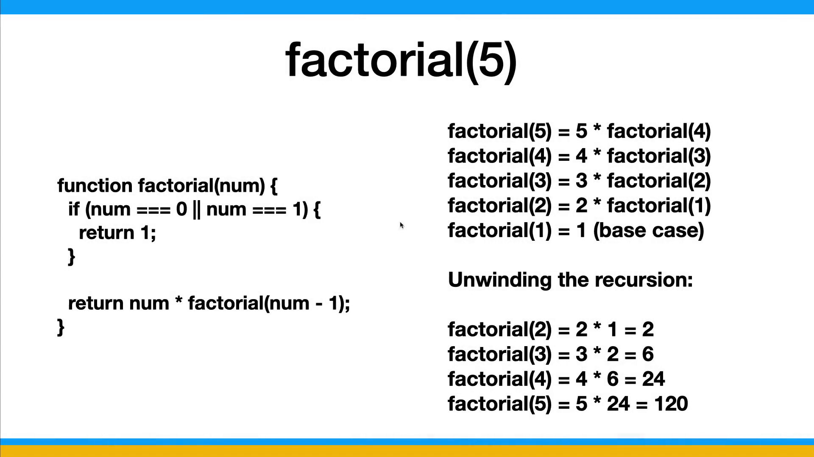

# Challenge: Factorial Using Recursion

## Description

The factorial of a number/integer is the product of that number and all of the numbers below it. It is denoted as `5!` (factorial of 5).

```text
- 0! = 1
- 1! = 1
- 2! = 2 * 1 = 2
- 3! = 3 * 2 * 1 = 6
- 4! = 4 * 3 * 2  * 1 = 24
- 5! = 5 * 4 * 3 * 2 * 1 = 120
```

The factorial function is commonly used in various mathematical and programming applications. It grows very quickly as `n` increases, which makes it a suitable challenge for exploring recursive functions.


## Instructions

Write a function called `factorial` that takes in a number and returns the factorial of that number.

### Function Signature

```js
/**
 * Returns the factorial of a number.
 * @param {number} num - The number.
 * @returns {number} - The factorial of the number.
 */
function factorial(num: number): number;
```

### Constraints

- The input number will always be a positive integer

### Hints

- Check if the number is 0 or 1. If it is, return 1.
- You can use recursion to calculate the factorial by multiplying the current number by the factorial of the previous number until you hit the base case.

### Examples

```js
factorial(0); // 1
factorial(5); // 120 (5! = 5 * 4 * 3 * 2 * 1 = 120)
factorial(10); // 3628800 (10! = 10 * 9 * 8 * 7 * 6 * 5 * 4 * 3 * 2 * 1 = 3628800)
```

### Test Cases

```js
test("Factorial of 0 should be 1", () => {
  expect(factorial(0)).toBe(1);
});

test("Factorial of 5 should be 120", () => {
  expect(factorial(5)).toBe(120);
});

test("Factorial of 10 should be 3628800", () => {
  expect(factorial(10)).toBe(3628800);
});
```

## Solutions

```js
function factorial(num) {
  if (num === 0 || num === 1) {
    return 1;
  }

  return num * factorial(num - 1);
}
```

### Explanation

The factorial function calculates the factorial of a given number using recursion.

If the input number is 0 or 1, the base case is reached, and the function returns 1 since 0! and 1! are both defined as 1.

For other input numbers, the recursive case is executed. The function calculates the factorial by multiplying the current number num with the factorial of num - 1, which is calculated recursively. This process continues until the base case is reached, at which point the recursion starts "unwinding" and the final result is obtained.

Let's go step by step to calculate factorial(5):

```js
factorial(5) = 5 * factorial(4)
factorial(4) = 4 * factorial(3)
factorial(3) = 3 * factorial(2)
factorial(2) = 2 * factorial(1)
factorial(1) = 1 (base case)
```

Unwinding the recursion:

```js
factorial(2) = 2 * 1 = 2
factorial(3) = 3 * 2 = 6
factorial(4) = 4 * 6 = 24
factorial(5) = 5 * 24 = 120
```

The final result is indeed 120, which is the correct factorial of 5.



### Diagram

```mermaid
graph TD
  A["START | FINISH"] -->|"CALL: factorial(5)"| B["5 * factorial(4)"]
  B -->|"CALL: factorial(4)"| C["4 * factorial(3)"]
  C -->|"CALL: factorial(3)"| D["3 * factorial(2)"]
  D -->|"CALL: factorial(2)"| E["2 * factorial(1)"]
  E -->|"CALL: factorial(1)"| F[BASE CASE MET, UNWIND THE CALLSTACK]
  F -->|RETURN: 1 because 1 * 1 | E
  E -->|RETURN: 2 because 2 * 1 | D
  D -->|RETURN: 6 because 3 * 2 | C
  C -->|RETURN: 24 because 4 * 6 | B
  B -->|RETURN: 120 because 5 * 24 | A
```
