# Challenge: Flatten Array

## Instructions

Write a function called `flattenArray` that takes in an array containing nested arrays of integers and returns a new array with all the integers from the nested arrays flattened into a single level.

### Function Signature

```js
/**
 * Returns a flattened array.
 * @param {number[]} arr - The array containing nested arrays.
 * @returns {number[]} - The flattened array.
 */
function flattenArray(arr: number[]): number[];
```

### Examples

```js
flattenArray([1, [2, 3], [4, 5, [6]]]); // should return [1, 2, 3, 4, 5, 6]
flattenArray([
  [1, 2],
  [3, [4, 5]],
  [6, [7]],
]); // should return [1, 2, 3, 4, 5, 6, 7]
flattenArray([1, [2, [3, [4, [5]]]]]); // should return [1, 2, 3, 4, 5]
```

### Constraints

- The input array can contain nested arrays of any depth
- The input array can contain any number of nested arrays

### Hints

- You can use recursion to traverse the nested arrays and flatten them.
- If the current element is an array, you can recursively call the `flattenArray` function on that element to flatten it further.

### Test Cases

```js
test("Flatten Nested Arrays", () => {
  expect(flattenArray([1, [2, 3], [4, 5, [6]]])).toEqual([1, 2, 3, 4, 5, 6]);
  expect(
    flattenArray([
      [1, 2],
      [3, [4, 5]],
      [6, [7]],
    ]),
  ).toEqual([1, 2, 3, 4, 5, 6, 7]);
  expect(flattenArray([1, [2, [3, [4, [5]]]]])).toEqual([1, 2, 3, 4, 5]);
});
```

## Solutions

```js
function flattenArray(arr) {
  let result = [];

  for (const item of arr) {
    if (Array.isArray(item)) {
      result = result.concat(flattenArray(item));
    } else {
      result.push(item);
    }
  }

  return result;
}
```

### Explanation

- Create a variable `result` to store the flattened array.
- Loop through the input array using a `for...of` loop.
- If the current element is an array, recursively call the `flattenArray` function on that element to flatten it further, and then concatenate the result to the `result` array.
- If the current element is not an array, push it to the `result` array.
- Return the `result` array.

The base case is implicitly handled within the loop structure. As the loop iterates through each element of the input array arr, the recursion eventually reaches the point where there are no more elements left to process.

When the input array arr is empty, the loop will not execute, and the function will directly return the empty result array.

### Diagram

```mermaid
graph TD
  A["flattenArray([1, [2, 3], [4, [5, 6]], 7])"] -->|"Start"| B["for loop"]
  B -->|"i=0"| C["if (Array.isArray(arr[0]))"]
  C -->|"False"| D["result.push(1)"]
  D --> B
  B -->|"i=1"| E["if (Array.isArray(arr[1]))"]
  E -->|"True"| F["flattenArray([2, 3])"]
  F -->|"Start"| G["for loop"]
  G -->|"i=0"| H["if (Array.isArray(arr[0]))"]
  H -->|"False"| I["result.push(2)"]
  I --> G
  G -->|"i=1"| J["if (Array.isArray(arr[1]))"]
  J -->|"False"| K["result.push(3)"]
  K --> G
  G -->|"End"| L["return [2, 3]"]
  L --> F
  F -->|"End"| M["result.push([2, 3])"]
  M --> B
  B -->|"i=2"| N["if (Array.isArray(arr[2]))"]
  N -->|"True"| O["flattenArray([4, [5, 6]])"]
  O -->|"Start"| P["for loop"]
  P -->|"i=0"| Q["if (Array.isArray(arr[0]))"]
  Q -->|"False"| R["result.push(4)"]
  R --> P
  P -->|"i=1"| S["if (Array.isArray(arr[1]))"]
  S -->|"True"| T["flattenArray([5, 6])"]
  T -->|"Start"| U["for loop"]
  U -->|"i=0"| V["if (Array.isArray(arr[0]))"]
  V -->|"False"| W["result.push(5)"]
  W --> U
  U -->|"i=1"| X["if (Array.isArray(arr[1]))"]
  X -->|"False"| Y["result.push(6)"]
  Y --> U
  U -->|"i=2"| Z["if (Array.isArray(arr[2]))"]
  Z -->|"False"| AA["result.push(7)"]
  AA --> U
  U -->|"End"| AB["return [5, 6]"]
  AB --> T
  T -->|"End"| AC["result.push(5)"]
  AC --> S
  S -->|"End"| AD["return [4, 5, 6]"]
  AD --> O
  O -->|"End"| AE["result.push([4, 5, 6])"]
  AE --> N
  N -->|"End"| AF["return [1, 2, 3, 4, 5, 6, 7]"]
  AF --> A
  A -->|"End"| AG["Result: [1, 2, 3, 4, 5, 6, 7]"]
```




