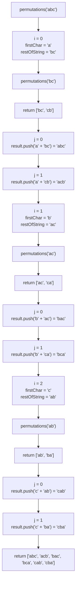
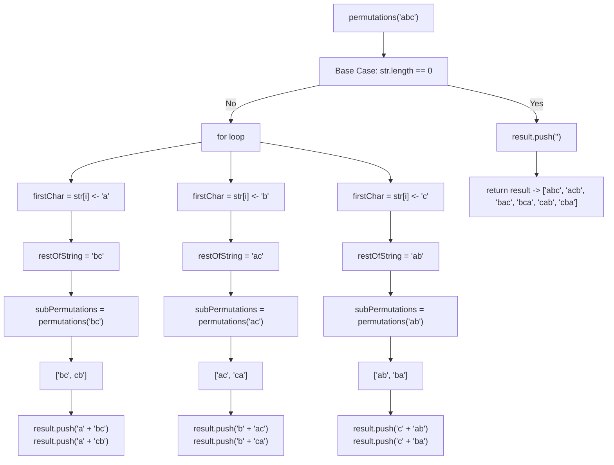

# Challenge: Permutations

## Instructions

Write a function called `permutations` that takes in a string as a parameter and returns an array of all possible permutations of the characters in the string.

### Function Signature

```js
/**
 * Returns all possible permutations of the characters in a string.
 * @param {string} str - The string to permute.
 * @returns {string[]} - An array of all possible permutations of the characters in the string.
 */
function permutations(str: string): string[];
```

### Examples

```js
permutations("abc"); // ['abc', 'acb', 'bac', 'bca', 'cab', 'cba']
permutations("dog"); // ['dog', 'dgo', 'odg', 'ogd', 'gdo', 'god']
```

### Constraints

- The input string will only contain lowercase letters
- The input string will not contain any duplicate characters

### Hints

- Think about how you can break down the problem of generating permutations using recursion.
- Consider what the base case for your recursion should be.
- You can use the `slice` method to remove a character from a string.
- you can use a for loop to iterate over the characters in the string and another for loop to iterate over the sub-permutations.

### Test Cases

```js
test("Permutations", () => {
  expect(permutations("abc")).toEqual([
    "abc",
    "acb",
    "bac",
    "bca",
    "cab",
    "cba",
  ]);
  expect(permutations("dog")).toEqual([
    "dog",
    "dgo",
    "odg",
    "ogd",
    "gdo",
    "god",
  ]);
  expect(permutations("")).toEqual([""]);
});
```

## Solutions

```js
function permutations(str) {
  const result = [];

  if (str.length === 0) {
    result.push("");
    return result;
  }

  for (let i = 0; i < str.length; i++) {
    const firstChar = str[i];
    const restOfString = str.slice(0, i) + str.slice(i + 1);
    const subPermutations = permutations(restOfString);

    for (let j = 0; j < subPermutations.length; j++) {
      result.push(firstChar + subPermutations[j]);
    }
  }

  return result;
}
```

### Explanation

- Intialize an empty array result to store the permutations.
- The base case is checked at the beginning. If the input string str is empty (length is 0), it means there are no characters to permute. In this case, an empty string is added to the result array, representing the only permutation for an empty string. The function then returns the result array.
- If the input string is not empty, the function proceeds to generate permutations using recursion and a loop.
- The outer loop iterates through each character of the input string str.
- Inside the loop, it extracts the current character (firstChar) from the input string.
- Create the restOfString by removing the current character from the input string. This restOfString will be used for generating permutations of the remaining characters.
- The function recursively calls itself with the restOfString to get all possible permutations of the remaining characters.
- The inner loop iterates through each permutation obtained from the recursive call (subPermutations).
- In the inner loop, the function appends the current character firstChar to each permutation obtained from the recursive call. This creates new permutations by inserting the current character in different positions.
- The new permutations are added to the result array.
- After the outer loop finishes, the function has generated all possible permutations of the input string.
- Finally, the result array containing all permutations is returned as the output of the function.

### Diagram




