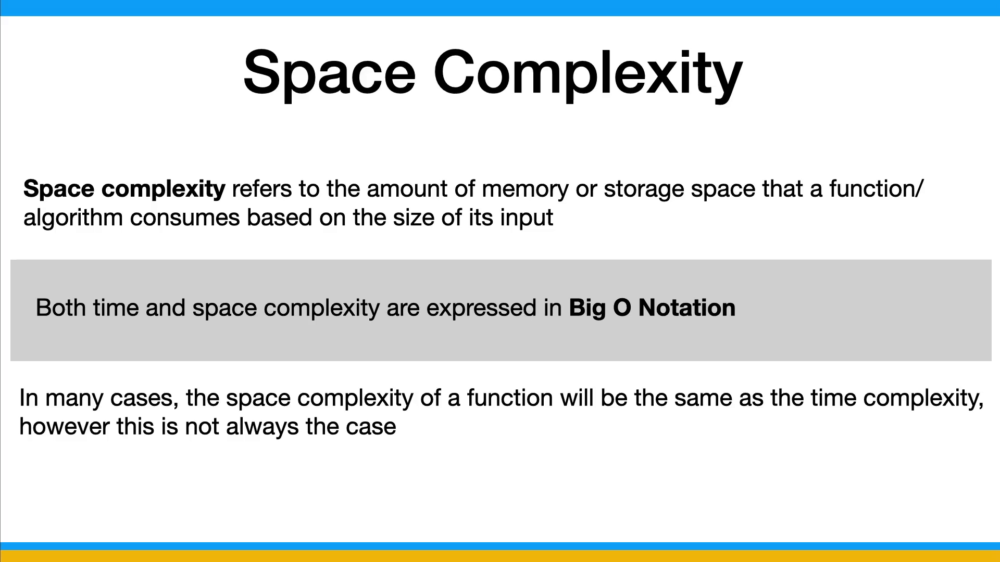
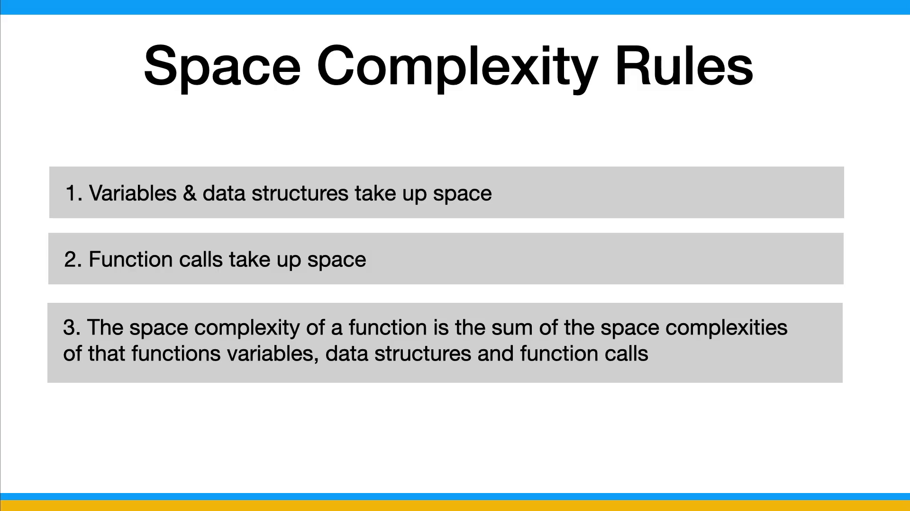

# What Is Space Complexity?

Space complexity refers to the amount of memory or storage space that an algorithm or function consumes based on the size of its input. It measures how the memory usage of an algorithm scales with the size of the input data. The goal is to optimize memory usage and minimize the additional memory required during the execution of an algorithm or program.

There are a lot of similarities between time and space complexity. We can use the same Big O notation to describe space complexity. We have constant, linear, quadratic, logarithmic, exponential, and factorial space complexity.

In many cases, the space complexity of a function will be the same as the time complexity. If a function takes `O(n)` time, it will also take `O(n)` space. If a function takes `O(n^2)` time, it will also take `O(n^2)` space. This is because the amount of memory used by a function is often directly related to the number of operations it performs. However, this is not always the case. Sometimes a function will take up more memory than time, or vice versa.



## Rules for Calculating Space Complexity

1. **Variables and data structures take up space:** When you declare variables or use data structures (arrays, objects, etc.) in your code, they occupy memory space based on their size and data type. The space complexity increases with the number and size of variables and data structures used in your program.

2. **Function calls take up space:** Whenever you call a function, the program needs to allocate memory for the function call stack, which includes function arguments, local variables, return addresses, and other bookkeeping information. Each function call adds to the space complexity, and if you have nested function calls or recursive functions, it can lead to a significant increase in space usage.

3. **The space complexity of a function is the sum of the space complexities of all the variables, data structures, and function calls inside the function:** This means that to calculate the space complexity of a function, you need to consider all the variables and data structures used within the function and their space requirements. Additionally, if the function makes any recursive or nested function calls, you need to account for the space used by those function calls as well.



## Examples of Space Complexity

Let's take a look at some examples:

## Constant Space `O(1)`

```js
function add(num1, num2) {
  return num1 + num2;
}
```

The space complexity of this function is `constant`. The function does not create any additional data structures or variables that depend on the input size. It simply returns the result of the addition, so the amount of memory used by the function does not change with the input size.

We can describe this function as `O(1)` in Big O notation.

## Linear Space `O(n)`

```js
function createArray(num) {
  const arr = [];

  for (let i = 0; i < num; i++) {
    arr.push(i);
  }

  return arr;
}
```

The space complexity of the function createArray(num) is `linear`. This is because the function creates an array and pushes elements into it using the for loop. As the input `num` increases, the size of the array also increases proportionally. Therefore, the space complexity of the function grows linearly with the input.

We can describe this function as `O(n)` in Big O notation.

## Quadratic Space `O(n^2)`

```js
function createMatrix(num) {
  const matrix = [];

  for (let i = 0; i < num; i++) {
    matrix[i] = [];

    for (let j = 0; j < num; j++) {
      matrix[i][j] = i + j;
    }
  }

  return matrix;
}
```

The space complexity of the function createMatrix(num) is `quadratic`. This is because the function creates a two-dimensional array and fills it with values using the nested for loops. As the input `num` increases, the size of the matrix also increases proportionally. Therefore, the space complexity of the function grows quadratically with the input.

We can describe this function as `O(n^2)` in Big O notation.

## Logarithmic Space `O(log n)`

```js
function findPower(base, exponent) {
  if (exponent === 0) {
    return 1;
  }

  if (exponent % 2 === 0) {
    const halfPower = findPower(base, exponent / 2);
    return halfPower * halfPower;
  } else {
    const halfPower = findPower(base, (exponent - 1) / 2);
    return base * halfPower * halfPower;
  }
}
```

The space complexity of the function `findPower(base, exponent)` is `logarithmic`. This is because the function uses recursion to calculate the power of a number. As the input `exponent` increases, the number of recursive calls increases logarithmically. Therefore, the space complexity of the function grows logarithmically with the input.

We can describe this function as `O(log n)` in Big O notation.

In these examples, the time and space complexity are the same. However, this is not always the case. Let's look at an example where the space complexity is different from the time complexity.

## Constant Time `O(1)` and Linear Space `O(n)`

```js
function findSum(arr) {
  let sum = 0;

  for (let i = 0; i < arr.length; i++) {
    sum += arr[i];
  }

  return sum;
}
```

The time complexity of the function `findSum(arr)` is `linear` or `O(n)`, where `n` is the length of the input array `arr`. This is because the function uses a loop to iterate through each element of the array and perform a constant-time operation (adding the element to the sum). The number of iterations is directly proportional to the size of the array.

The space complexity of the function is `O(1)`, which is `constant`. This is because the function only uses a single variable sum to store the result. The space used by the variable does not depend on the size of the input array, so it remains constant regardless of the input size.
