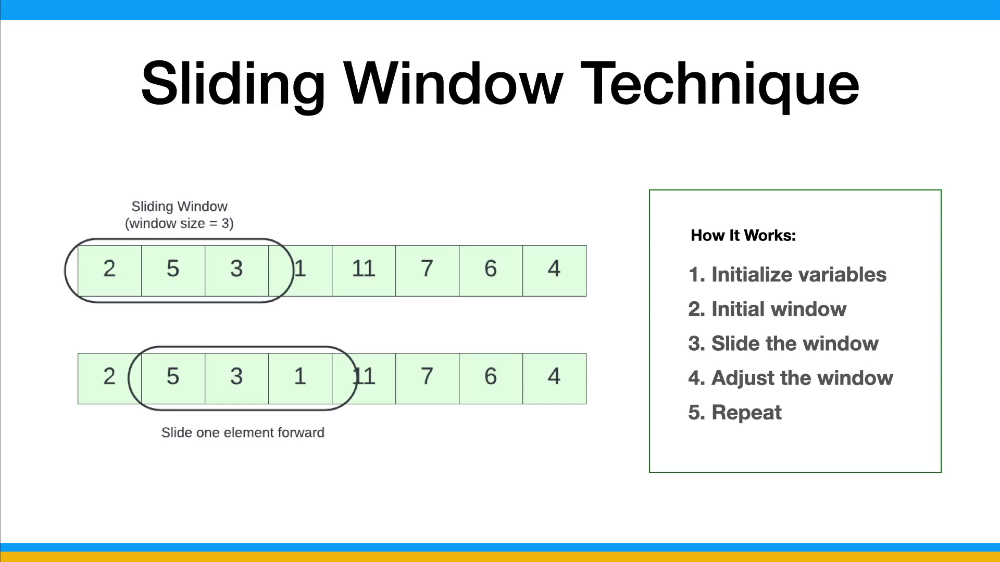

# Sliding Window Technique

The sliding window technique is a powerful algorithmic approach used to solve various array or string-related problems efficiently. It involves maintaining a "window" that slides through an array or string, allowing you to track and process a subset of elements without the need for nested loops.

This technique can be used to maximize the time complexity of your algorithms. In the last video, we did a sub array sum algorithm that used nested for loops and had a time and space complexity of O(n^2), which is not very efficient. In the next video, we're going to refactor that solution and make it linear O(n) by using this sliding window technique. The reason I'm showing you this technique is to give you an example of doing the same thing and improving efficiency and complexity.

## How it Works

Let's talk a little bit about how this works:

1. **Initialize Variables:** Set up two pointers, usually named `left` and `right`, to define the boundaries of the sliding window. Additionally, you might need variables to store the current state, like sums or frequencies. For our example, we'll need a `currentSum` and `maxSum`.

2. **Initial Window:** We start by positioning the window at the beginning of the array or string and calculate the initial state or value based on the elements within the window. Since we're getting the sum of `k` elements, we'll start with a window of `k` elements. In this example `k` or the window size is `3`.

3. **Slide the Window:** We'll move the `right` pointer to the right, expanding the window by one element. Update the state or value based on the newly added element. In our case, we would calculate the new sum with the new element.

4. **Adjust the Window:** Depending on specific conditions or constraints, you might need to shrink or adjust the window by moving the `left` pointer to the right, thus excluding an element from the window. Again, update the state accordingly.

5. **Repeat:** Continue sliding and adjusting the window until the `right` pointer reaches the end of the array or string. During this process, keep track of the desired information (maximum/minimum, frequency, substring, etc.).

## Advantages

- **Optimized Time Complexity:** Sliding window reduces the time complexity by avoiding redundant calculations. It's particularly beneficial for situations where brute-force solutions would require nested loops.

- **Space Efficiency:** The technique doesn't require storing all individual subarrays or substrings, reducing memory usage.

- **Simplicity:** Once understood, sliding window problems often become easier to solve compared to their naive counterparts.

## Notes

- Sliding window is best suited for problems that involve contiguous subarrays or substrings.
- The technique can have variations such as dynamic window size or two-pointer sliding.
- Be cautious of edge cases where the window size becomes important for efficiency or correctness.
